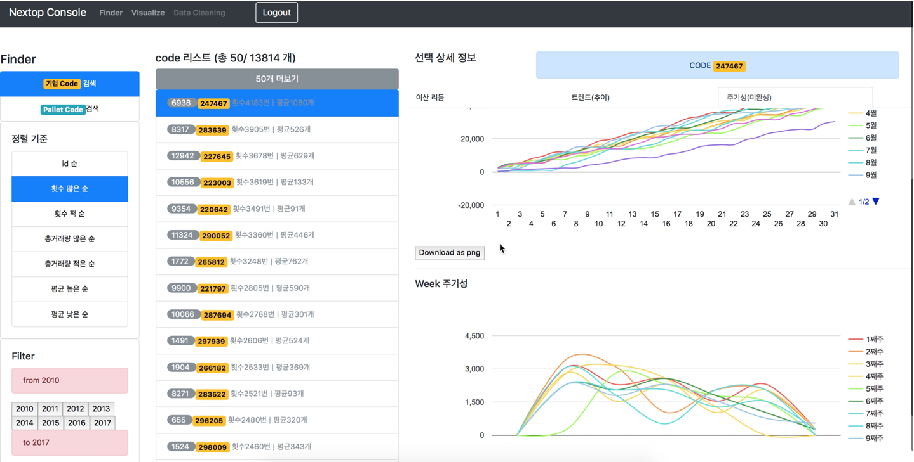

# Nextop Console
Nextop Console Data Anaylsis Assistant Web App

(powered by AngularJS - Django - Nginx - PostgreSQL - Linux - Docker)

## 시연영상

https://www.youtube.com/watch?v=ds4iv8IvGek

## 3 docker virtual macines

I run theee docker virtual machines, which is for 1.django, 2.nginx web server, 3.postgresql Database .

I manage three containers(virtual machines) by docker compose.

about docker... go to [here](https://www.docker.com/)

about docker-compose... go to [here](https://docs.docker.com/compose/)

## Directory structure

### 'django-image'

django custom docker image build files for django docker container.

### 'host-docker-machine-file'

The connected volumes which have the same files for each three containers.

#### 'nginx-volume'

files for nginx server configuration

#### 'web-volume'

files for django web app logic

#### 'media'

uploaded by users

#### 'static'

javascript and css

### 'docker-compose.yml' & 'docker-compose-distrib.yml'

docked-compose configuration file for each development and deployment.

### 'update-distrib.sh'

bash file for automation of distributing server to azure web service.
